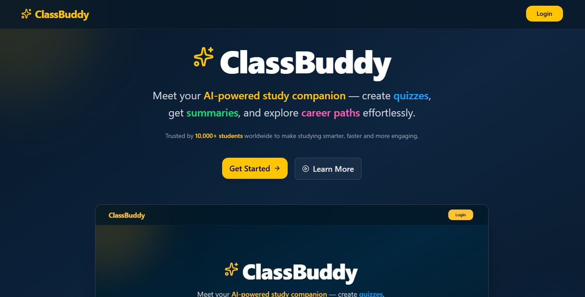

# CrossLearning

CrossLearning is a full-stack web application designed to enhance classroom collaboration, note sharing, and communication between students and teachers.



## ✨ Features

### **1. AI-Powered Teacher Notes**
- Teachers can **generate notes with the help of AI**.
- Perform **CRUD operations** (Create, Read, Update, Delete) on their notes.
- Students can **view these notes** if they **join the teacher’s group**.
- Seamless **note sharing** and **collaboration** within the group.


### 💬 **Group Collaboration**
- Teachers can create groups for their classes.
- Students can join groups to access shared notes and discussions.
- Built-in **chat system** for quick communication between teachers and students.

### 🔒 **Secure Authentication**
- Role-based login system (**Teacher / Student**).
- **JWT-based authentication** for API protection.
- Session management via secure tokens.

### ☁️ **Cloud Integration**
- Media uploads powered by **Cloudinary**.
- **PostgreSQL (NeonDB)** for scalable cloud database.
- **Dockerized setup** for easy deployment and reproducibility.

### 🧠 **Agentic AI Workflow**
- Teachers’ notes are generated using **Gemini 2.5 Flash + Tavily Search**.
- Integrated through **LangChain** and **LangGraph** for autonomous multi-step reasoning.
- The system intelligently searches, summarizes, and generates structured Markdown notes.


## Tech Stack

**Frontend:**
- React 19 (with TypeScript)
- Vite
- Redux Toolkit
- Tailwind CSS
- Radix UI
- Axios
- React Router

**Backend:**
- FastAPI (Python)
- SQLAlchemy
- PostgreSQL (NeonDB)
- Uvicorn
- Cloudinary (for media)
- Langchain, Langgraph (AI/LLM features)
- JWT Authentication

**DevOps:**
- Docker & Docker Compose

---

## Project Structure

```
CrossLearning/
│
├── client/      # Frontend (React)
├── server/      # Backend (FastAPI)
├── docker-compose.yml
└── README.md
```

---

## Setup Instructions

### Prerequisites

- Node.js (v18+ recommended)
- Python 3.10+
- Docker & Docker Compose

### 1. Clone the repository

```sh
git clone https://github.com/Sandeep-singh-99/CrossLearning.git
cd CrossLearning
```

### 2. Environment Variables

Create a `.env` file in `server/` with the following (example):

```env
DATABASE_URL=your_postgres_url
JWT_SECRET_KEY=your_jwt_secret
CLOUDINARY_CLOUD_NAME=your_cloudinary_name
CLOUDINARY_API_KEY=your_cloudinary_key
CLOUDINARY_API_SECRET=your_cloudinary_secret
GOOGLE_API_KEY=your_google_api_key
TAVILY_API_KEY=your_tavily_api_key
```

### 3. Start with Docker (Recommended)

```sh
docker-compose up --build
```

- Frontend: http://localhost:5173
- Backend: http://localhost:8000

### 4. Manual Setup (Development)

#### Backend

```sh
cd server
python -m venv venv
source venv/bin/activate  # On Windows: venv\Scripts\activate
pip install -r requirements.txt
uvicorn app.main:app --reload
```

#### Frontend

```sh
cd client
npm install
npm run dev
```

---

## Usage

- Register/login as a student or teacher.
- Create or join groups, chat, and share notes.
- Teachers can upload insights and manage content.
- AI-powered features for note generation and chat.

---

## License

MIT

---
